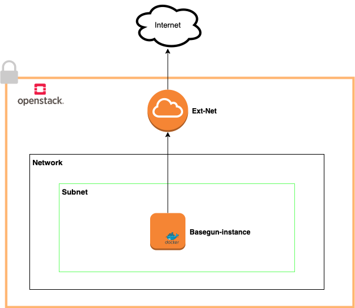

# Terraform deployment

This folder is used to create Basegun deployment with Terraform, an open-source infrastructure as code (IaC) on Openstack project.

## Terraform

- `backend.tf` : the remote state (in Swift container), where current state is stored.
- `instance.tf` : the desirated instance (image, flavor, volume size, network and address, security group)
- `output.tf` :
- `provider.tf` : 
- `template.tf` : 
- `variable.tf` : 
- `version.tf` : 
## Scripts

